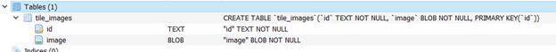
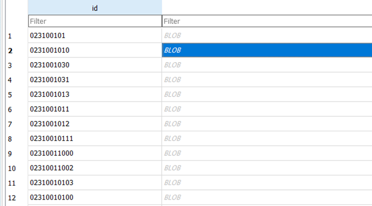
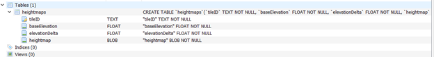
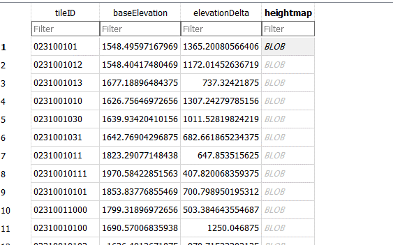

# External Imagery Database

The format of the sqlite imagery database is as follows:




The sqlite database has a table called 'tile\_images'.
Within the 'tile\_images' table, the images are stored based on the
QuadKey. The image is stored as a 256x256 png file. The image can
also be in the jpeg format.

## Decoding the TileID

To convert a Geodetic2D to a Terrain Tile Index, take a look at the WMSConversions.cs file.
Within the file, there is a function 

```
public static void GeoToTileXY(Geodetic2d geo, int levelOfDetail, out int tileX, out int tileY)
```

In order to get the extents of a Terrain Tile Index, take a look at the function:

```
public static GeoBoundingBox TileToBounds(TerrainTileIndex idx)
```

Finally, to convert the TerrainTileIndex to the QuadKey, look at:

```
public static string TileToQuadKey(TerrainTileIndex idx)
```

# Setting up the config file to use external imagery databases
```
"terrainTileProviders":
{
  "type": "sql",
  "options": {
    "databaseFile": "D:\\ExternalDatabase\\imagery.db",
    "readOnly" : true,
    "fallback":
    {
      "type" : "osm"
    }
  }
}
```

| available options | description                                                                                          |
|-------------------|------------------------------------------------------------------------------------------------------|
| "databaseFile"    | absolute filepath to the sqlite database file                                                        |
| "readOnly"        | When true, images that are fetched from the fallback (if present) are not saved back to the database |
| "fallback"        | fallback to another imagery provider, e.g. Bing imagery                                              |


# External Elevation Database

The format of the sqlite database is as follows:




It contains a single table called "heightmaps".

Similar to the imagery database, the heightmaps are indexed based on the QuadKey 
although it contains some additional metadata, namely 'baseElevation' and 'elevationDelta'.

Just like the imagery database, the elevation database can contain heightmaps from multiple levels of detail.

The baseElevation is the minimum value of the elevation. 
The elevationDelta is the maximum value minus the minimum value of the elevation.

The heightmap is not stored as a float array of elevation values.
Instead, the values are stored as 2 byte integers 1 byte integers,
depending on whether the heightmaps are stored as 1 byte per pixel or 2.

The dimension of the heightmap must be 256 by 256.

Lets say you have a float array of the elevations. The following
function converts it to the format expected:

```
int ConvertValue(float elev)
{
	return (int)((elev - minElev) * quantaSize / deltaElev)));
}
```

where quantaSize is either 255 (2^8 - 1) if using 8 bytes per pixel or 65536 (2^16 - 1) if using 16 bytes per pixel.

minElev and deltaElev are the values 'baseElevation' and 'elevationDelta' respectively.

# Setting up the config file to use external elevation databases

```
  ///Elevations
  "elevationProviderType": "sql",

  //Settings for each elevation provider
  "elevationProviderSettings": {
    "sql": {
      //SQLite database containing elevations
      "databaseFile": "D:\\ExternalDatabase\\elevation.db",
      //The base LOD to use when determining the 'highest quality' LOD
      "baseLOD": 15,
      //If true, the database contains downsamples of the baseLOD
      //and will load those accordingly
      "useDownsamples": true,
      //If set, create a second elevation provider to fallback on
      "fallback": "bing" 
    },
    "bing": {
      //The bing API key to use
      "apiKey": ""
    }
  },
```

In this config, the elevation provider will query the database file 'elevation.db'. 
If the heightmap is not within the database, it will fallback to use Bing elevation.

Similarly, if a tile image is not found in sqlite database it will look in the fallback.
However, if the tile is not found in either the DB or the fallback, then that tile all
the child tiles underneath it will not load. 
Also note that it is possible to chain multiple fallbacks.
A global database can prevent this from happening.

| available options | description                                                                             |
|-------------------|-----------------------------------------------------------------------------------------|
| "databaseFile"    | absolute filepath to the sqlite database file                                           |
| "useDownsamples"  | whether or not to use heightmaps of lower detail (downsampled) when necessary           |
| "baseLOD"         | which level of detail to use                                                            |
| "fallback"        | fallback to another elevation provider, e.g. Bing elevation                             |

# WMS

Example config:

```
"terrainTileProviders":
 {
    "type": "wms",
    "options": {
      "format": "png",
	  "srs" : "EPSG:4326",
	  "baseUrl" : "https://sedac.ciesin.columbia.edu/geoserver/wms",
	  "layers" : ["lulc:lulc-development-threat-index_wind"],
	  "fallback" : "web"
    }
  }

```

| available options   | description                                                                                                                                              |
|---------------------|----------------------------------------------------------------------------------------------------------------------------------------------------------|
| "baseUrl"           | The service's base URL, prior to parameters. eg 'http://website.com/geoserver/wms/' which is turned into 'http://website.com/geoserver/wms/?service=WMS' |
| Username (optional) |                                                                                                                                                          |
| Password (optional) |                                                                                                                                                          |
| "srs"               | The Srs to use, in <Authority>:<Code> form, eg 'EPSG:3857'                                                                                               |
| "format"            | The format to use, such as 'png' and 'jpeg'                                                                                                              |
| "layers"            | The layers to retrieve                                                                                                                                   |
